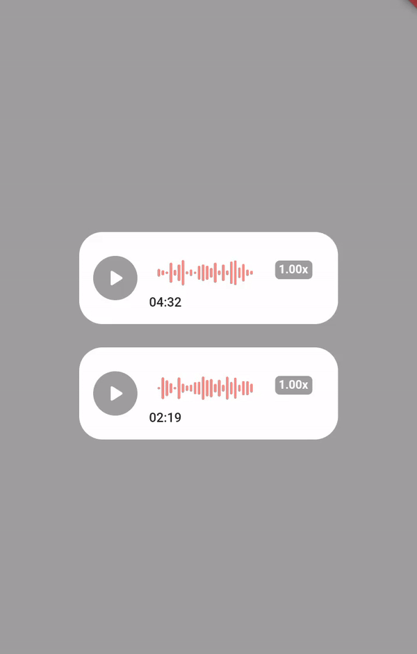
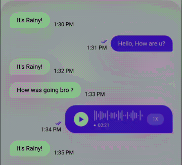

## Flutter voice message player

<!-- <p align="center">
    
</p> -->
<div style="height:6px;"></div>

<div style="height:32px;"></div>



## Demo

<div style="height:24px;"></div>



<div style="height:12px;"></div>
<p style="font-size: 18px" >
Voicey is a flutter package to play voice messages in chats. Also, you can sicking by dragging on voice noises.
</p>
<div style="height:40px;"></div>

## Platform Support

| Android | iOS | MacOS | Web |
| :-----: | :-: | :---: | :-: |
|   ✔️    | ✔️  |  ✔️   | ✔️  |

<div style="height:16px;"></div>

## Installation

First add voicey to your pubsbec.yaml file:

```yml
dependencies:
  voice_message_player: <latest-version>
```

<div style="height:12px;"></div>

Next, get package from pub dependencies:

```dart
flutter pub get
```

<div style="height:40px;"></div>

## How to use

All you need is pass your audio file src to VoiceMessagePlayer widget:

```dart
VoiceMessagePlayer(
  controller: VoiceController(
    audioSrc:
        'https://dl.solahangs.com/Music/1403/02/H/128/Hiphopologist%20-%20Shakkak%20%28128%29.mp3',
    onComplete: () {
      /// do something on complete
    },
    onPause: () {
      /// do something on pause
    },
    onPlaying: () {
      /// do something on playing
    },
    onError: (err) {
      /// do somethin on error
    },
  ),
  maxDuration: const Duration(seconds: 10),
  isFile: false,
  innerPadding: 12,
  cornerRadius: 20,
),
```

## Todo

- [✔️] Cache audio and play from cache.
- [✔️] Seeking on audio by drag on noises.
- [✔️] Change playback speed.
- [✔️] Handle exceptions.
- [✔️] Customization .
- [✔️] Dynamic width for voice widget.

<div style="height:32px;"></div>


<h2>
<a style="text-decoration: none; color: #0000ff" href="https://github.com/Moeed366">Moeed366</a>
</h2>

<div style="height:16px;"></div>
### Contributing


## License

Licensed under the MIT license. See [LICENSE](https://github.com/Moeed366/voice_message_player/blob/main/LICENSE "LICENSE").

